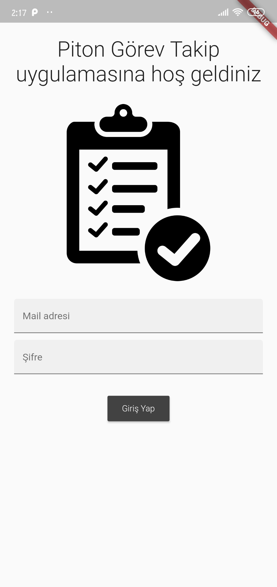
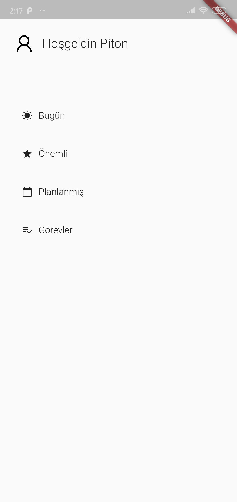
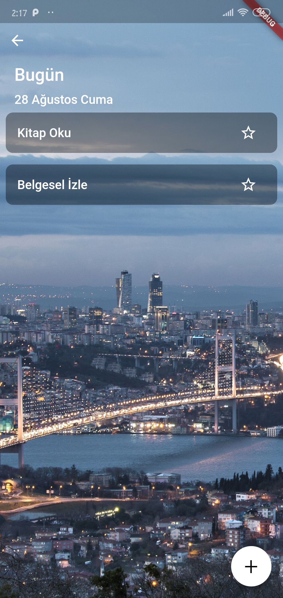
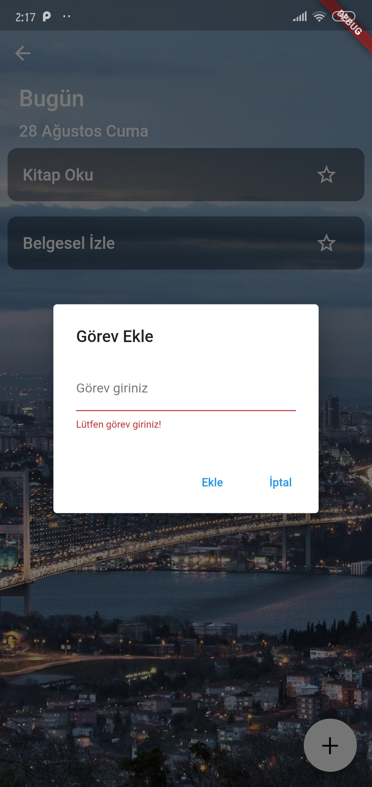

# Flutter Görev Takip

Yapmış olduğum Flutter projesinde görev takip sistemini içermektedir. Bu küçük çaplı proje 5 sayfadan oluşmaktadır. Proje genel tasarım olarak oluşturulmuştur.
- Üyelerin giriş yapabileceği giriş sayfası tasarımı
- Uygulama menüsünü barındıran anasayfa
- Bugün için yapılması gereken görevlerin ekleneceğini bugün görev sayfası
- Görevler arasında önem arz edenlerin gösterildiği sayfa
- İleriye dönük planlarınların listelendiği görev sayfası
- Tüm görevlerin yer aldığı sayfadır.

 
  

